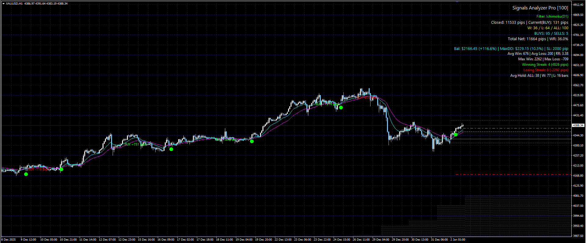

# MA Cross Signals Analyzer

Advanced Moving Average Crossover indicator for MetaTrader 4, providing real-time profit analysis, risk management tools, and comprehensive trading statistics.

## Key Features

- **Dual Moving Averages**: Customizable Fast and Slow MA periods (SMA, EMA, etc.).
- **Signal Bullets**: Automatic Buy (Green) and Sell (Red) bullets plotted at crossover points.
- **Signals Analyzer Dashboard**: Real-time display of closed, open, and total net profit in pips, with Win Rate percentage and RR Ratio.
- **Risk Analyzer**: Simulate 'Virtual Balance' and 'Lot Size' (including **Dynamic Compounding** mode) to track Account Balance and Maximum Drawdown (Money & %) historically directly on the chart.
- **HTF Filtering**: Option to filter current timeframe signals by the trend of a Higher Timeframe (e.g., only buy on M15 if H4 trend is up).
- **ADR Filter**: Option to filter trades based on remaining Average Daily Range (Upsize/Downsize %) to avoid buying at the top or selling at the bottom.
- **Ichimoku Kumo Filter**: Validates signals based on the Ichimoku cloud position (Buy above Cloud, Sell below Cloud) with multi-timeframe support.
- **Signal Analysis Limit**: Option to limit dashboard statistics to the last **X** trades (default 100) to focus on recent performance.
- **Average Holding Time**: Displays precisely how many bars on average winning and losing trades are held.
- **Market Bias Filter**: Restrict the indicator to showing only Buy signals, only Sell signals, or both.
- **ADR Filter & Visuals**: Validates signals based on the daily range and plots **Daily Open**, **ADR High/Low**, and **ADR Mid** lines directly on your chart.
- **MTF Ichimoku Cloud**: Renders the Ichimoku cloud from your **Filter Timeframe** (e.g., H4) onto your current trading chart for a higher-level trend perspective.
- **Adjustable Pip Definition**: Custom multiplier to standardize pips (Defaults to **10.0** for Gold/XAUUSD so 1 pip = 0.1 USD).
- **Trading History Statistics**: View record Winning/Losing Streaks (count and total pips) and biggest individual trade win/loss.
- **On-Chart Performance Labels**: Historical trade profit displayed directly near signal arrows for easy verification and backtesting.
- **Efficient Calculation**: Optimized to process only new data on each tick and simulate historical "trades".
- **Clean Cleanup**: Automatically removes all chart objects when the indicator is removed.

## Installation

1. Open your MetaTrader 4 terminal.
2. Go to `File` > `Open Data Folder`.
3. Navigate to `MQL4/Indicators`.
4. Create a folder named `MACross` and copy the `MACross.mq4` file into it.
5. Restart MetaTrader 4 or right-click `Indicators` in the Navigator and select `Refresh`.

## Parameters

### Moving Averages
- **FastPeriod / SlowPeriod**: Periods for the crossover calculation.
- **FastMethod / SlowMethod**: MA type (EMA, SMA, SMMA, LWMA).

### Signal Filters
- **UseHTF_Filter**: Enables trend filtering from a **Higher Timeframe**.
- **UseIchimokuFilter**: Filters signals based on price position relative to the **Kumo Cloud**.
- **UseADR_Filter**: Prevents entries if the remaining **Average Daily Range** is insufficient.

### Risk & Statistics
- **VirtualBalance**: Starting balance for monetary simulator.
- **UseDynamicLot**: Enables **Compounding** (Lot size grows with balance).
- **FixedStopLoss**: Automatically "closes" trades if loss exceeds these pips at bar close.
- **MaxTradesToAnalyze**: Limits dashboard stats to the most recent **X** trades (0 = All).

## License

[MIT License](LICENSE)
